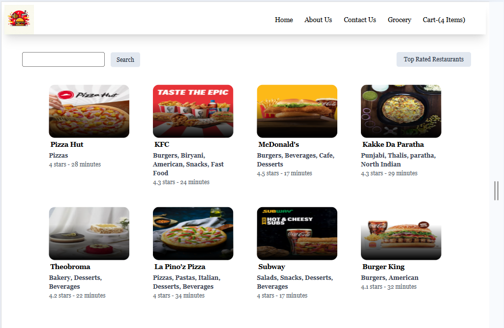
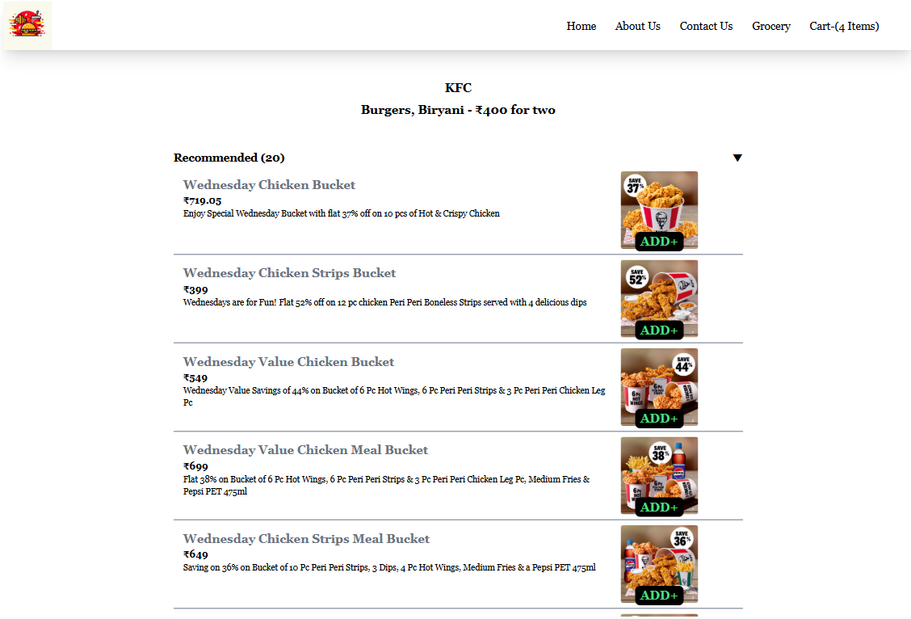
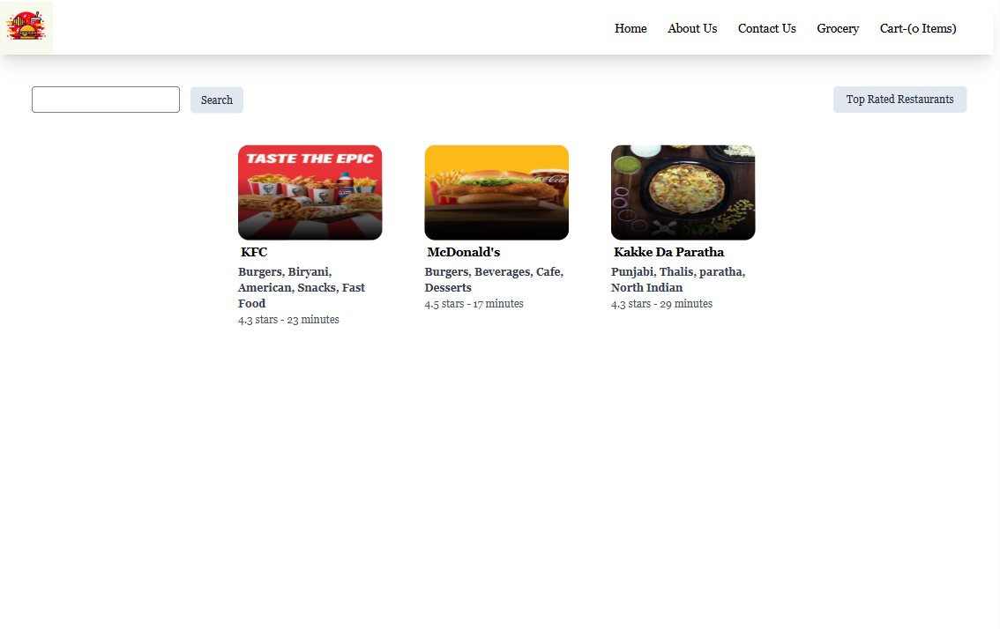
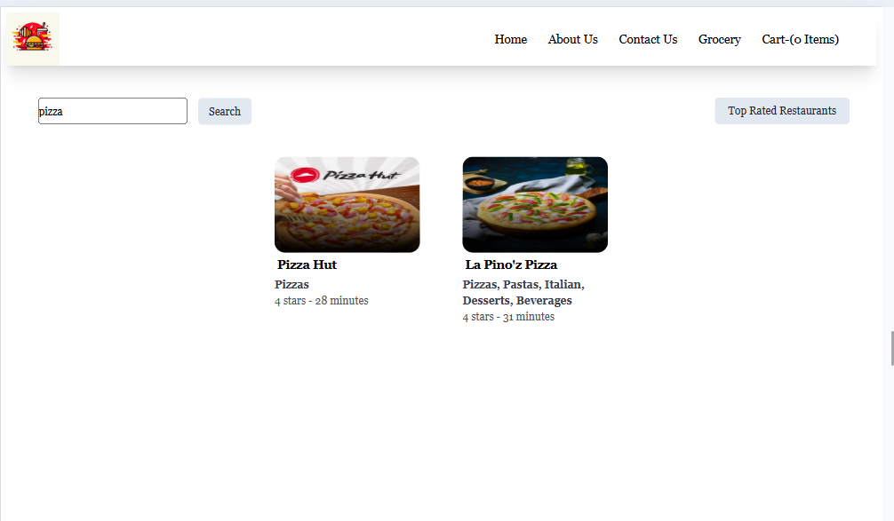
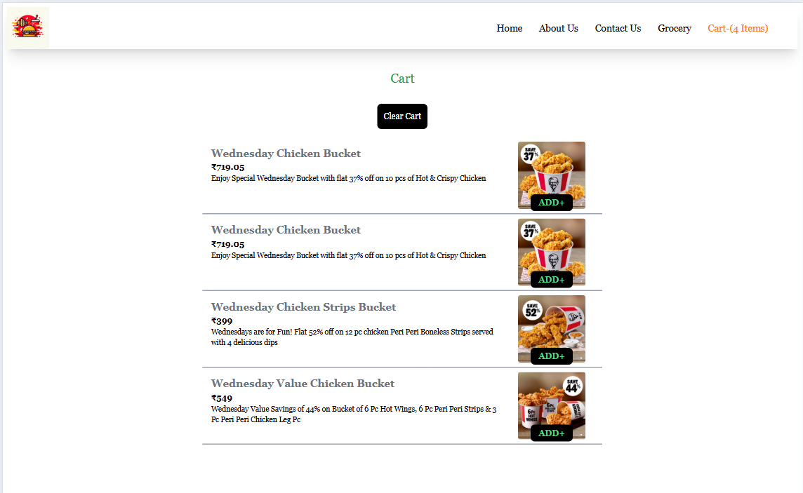

# GourmetHub

It is React.js-based application that allows users to browse restaurants, explore menus, and place food orders effortlessly. This app utilizes the Swiggy API to fetch real-time restaurant and menu data.

## Features:

- Browse Restaurants- View a list of restaurants based on location or cuisine.
- Add to Cart- Select items from the menu and add them to the cart for checkout.
- Search Functionality- Search for specific restaurants
- Filter- Filter restaurants by rating.

## Screenshots

- Home Page
  

- Restaurant Menu Page
  

- Top rated restaurants Page
  

- Searched restaurants Page
  

- Cart Page
  

## Installation:

Steps to set up the project locally:

Frontend:

1. Clone the repository

```bash
   git clone https://github.com/monikakhanka/Gourmet.git
```

2. Navigate to the project directory

```bash
   cd Gourmet
```

3. Install dependencies

```bash
   npm install
```

4. To be able to access swiggy APIs, download cors extension for browser.
5. In constants file, uncomment the variables for local development.
6. Start the development server

```bash
   npm run start
```

## Technologies used:

List of tools, libraries and frameworks used in the project

- Frontend: React, daisyui
- Backend: Swiggy API
- Build tool: Parcel
- Deployment: Netlify

## How it works

Steps to use the app:

1. Home page:

- View the list of restaurants in the home page
- Click on any one of the restaurants

2. Restaurant Menu:

- On clicking a particular restaurant on home page, the menu list containing all the items is shown.
- Add the item you want to order to the cart by clicking on the add button on the image of food item.

3. Cart:

- Go to the cart page, verify the list of food items added to the cart
- checkout from the cart

4. Search:

- Search the name of a particular restaurant in the search input.
- The restaurants matching the name of the searched restaurant appears on the page.
- On clicking on the restaurant, menu of the restaurant is displayed, add item to the cart.

5. Top rated restaurants:

- Displays the restaurants rated above 4 stars.

## Roadmap

- Checkout from the cart.
- Adding Payment gateway.
